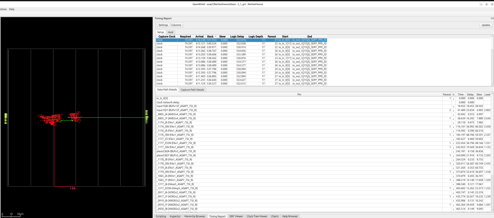

# Naja Bazel OpenROAD flow

Demonstrates how to use Naja and Bazel to generate reports.

## Installation

Install [Bazelisk](https://bazel.build/install/bazelisk), Bazelisk will download all other dependencies using Bazel.

## Build and view design

Global route is enough to learn everything there is to learn about this example design.

To build and view example design after global route:

    bazelisk run RetimeFanout_grt /tmp/grt gui_grt

## Run naja_edit.py post synthesis and generate new netlist

The dependency of this rule is to run ORFS synthesis and pass the netlist to Naja. Naja will then read in this netlist, generate some reports and write out a new netlist. This netlist is fed into regular ORFS flow above `bazelisk run RetimeFanout_grt /tmp/grt gui_grt`

    bazelisk build naja
